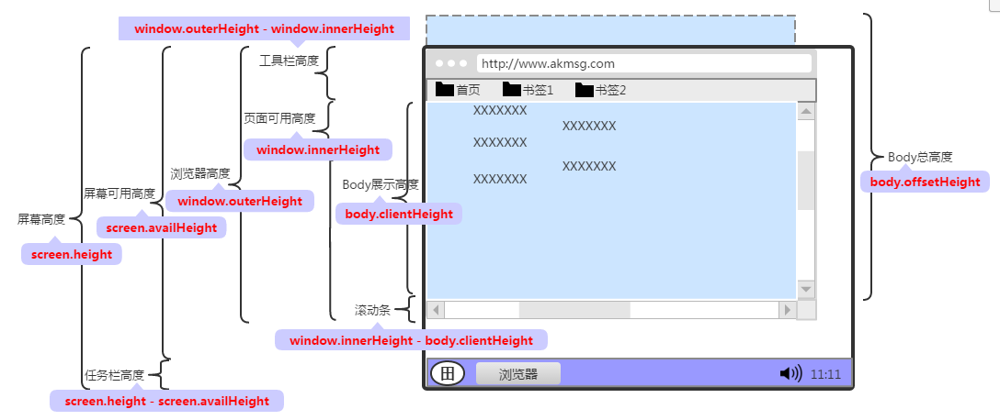
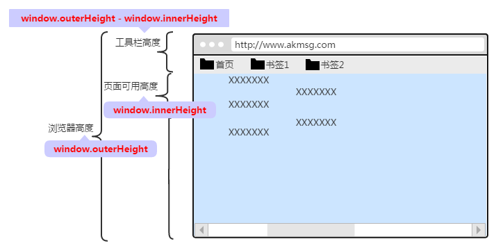

# HTML 获取屏幕、浏览器、页面的高度宽度
本篇主要介绍Web环境中屏幕、浏览器及页面的高度、宽度信息。

## 目录
1. 介绍：介绍页面的容器(屏幕、浏览器及页面)、物理尺寸与分辨率、展示等内容。
2. 屏幕信息：介绍屏幕尺寸信息；如：屏幕、软件可用以及任务栏的高度和宽度。
3. 浏览器信息：介绍浏览器尺寸信息；如：浏览器、内部页面以及工具栏的高度和宽度。
4. 页面信息：介绍HTML页面尺寸信息；如：body总的、展示的高度和宽度。

### 一、介绍

#### 1.容器
一个页面的展示，从外到内的容器为：屏幕、浏览器以及页面本身。 
HTML元素展现在页面内，页面展现在浏览器内，而浏览器展现在屏幕内。 
通过Js的一些对象可以获取这些容器的高度、宽度。
#### 2.物理尺寸和分辨率
容器的尺寸是指当前分辨率下的高度、宽度，而不是物理高度、宽度。 
如：一个22寸的显示器，屏幕分辨率为1366 * 768，那么获取到的屏幕高度为1366px，宽度为768px。

#### 3.展示图

### 二、屏幕信息

screen.height ：屏幕高度。 
screen.width ：屏幕宽度。 
screen.availHeight ：屏幕可用高度。即屏幕高度减去上下任务栏后的高度，可表示为软件最大化时的高度。 
screen.availWidth ：屏幕可用宽度。即屏幕宽度减去左右任务栏后的宽度，可表示为软件最大化时的宽度。 
任务栏高/宽度 ：可通过屏幕高/宽度 减去 屏幕可用高/宽度得出。如：任务栏高度 = screen.height - screen.availHeight 。

### 三、浏览器信息

window.outerHeight ：浏览器高度。 
window.outerWidth ：浏览器宽度。 
window.innerHeight ：浏览器内页面可用高度；此高度包含了水平滚动条的高度(若存在)。可表示为浏览器当前高度去除浏览器边框、工具条后的高度。 
window.innerWidth ：浏览器内页面可用宽度；此宽度包含了垂直滚动条的宽度(若存在)。可表示为浏览器当前宽度去除浏览器边框后的宽度。 
工具栏高/宽度 ：包含了地址栏、书签栏、浏览器边框等范围。如：高度，可通过浏览器高度 - 页面可用高度得出，即：window.outerHeight - window.innerHeight。

### 四、页面信息

body.offsetHeight ：body总高度。 
body.offsetWidth ：body总宽度。 
body.clientHeight ：body展示的高度；表示body在浏览器内显示的区域高度。 
body.clientWidth ：body展示的宽度；表示body在浏览器内显示的区域宽度。 
滚动条高度/宽度 ：如高度，可通过浏览器内页面可用高度 - body展示高度得出，即window.innerHeight - body.clientHeight。
